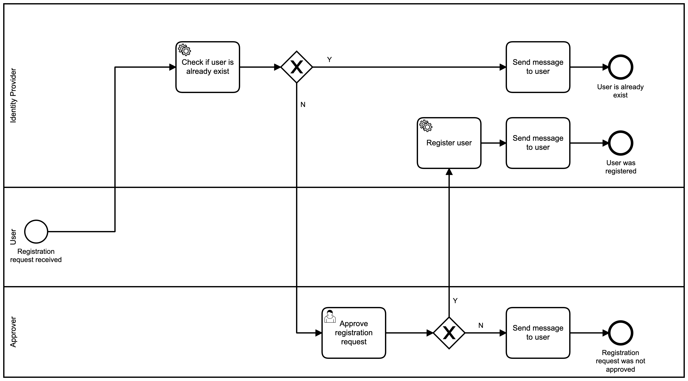

# Description
A prototype of a process for registration of users in keycloak from camunda with manual approvals.

Camunda framework uses keycloak admin API for server communications.

# Process diagram


# How to run and try
The prototype can be run using docker-compose to make it simple. For starting it, use the following commands
* ```./gradlew clean build dockerCreateDockerfile```
* ```docker-compose build```
* ```docker-compose up```

### There are two ways to start the process:
1. Using REST API
    * POST http://localhost:8080/rest/process-definition/key/RegistrationProcess/start
    with body
    ```json
   {
   	"variables": {
   		"username" : {
            "value" : "User1",
           	"type": "String"
       	},
       	"email" : {
           	"value" : "User1@gov.com",
           	"type": "String"
       	},
       	"password" : {
           	"value" : "123",
           	"type": "String"
       	}
     },
    "businessKey" : "myBusinessKey"
   }
   ```
2. Clicking 'Start process' button in tasklist and entering all required data.    

The process will create a task for user from approvers group to approve registration request. 
After completing the task, a message for user with an outcome will be stored in 'messageToUser' variable, which can be retrieved by rest API using the following request:

GET http://localhost:8080/rest/history/variable-instance?processInstanceId=<processInstanceId>